# Traffic Sign Detection and Classification in Diverse Lighting

A computer vision and deep learning pipeline designed to reliably detect, segment, and classify road signs under challenging environmental conditions, including poor contrast, extreme shadows, overexposure, and rain. The system utilizes a dual-stage architecture: classical computer vision techniques for illumination correction and candidate region proposals, followed by a Convolutional Neural Network (CNN) with confidence rejection to eliminate false positives.

---

## Visual Demonstration

The pipeline reliably detects standard traffic signs under ideal and severe weather conditions while rejecting non-sign red objects (such as apples, red vehicles, or taillights) through Softmax confidence gating.

| Standard Detection | Adverse Conditions (Rain / Low Light) | False-Positive Rejection (Apple) |
| :---: | :---: | :---: |
| 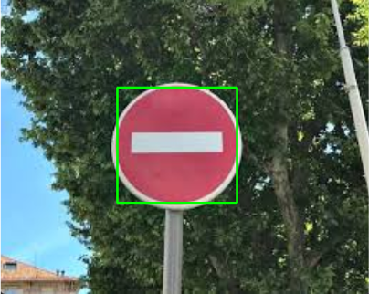 | 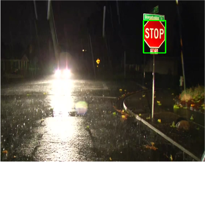 | 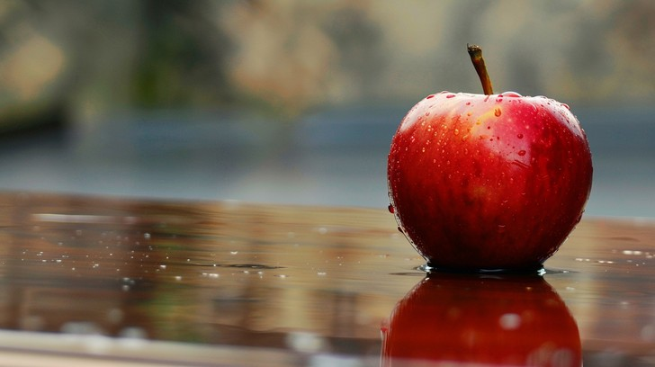 |
| **Stop Sign** (100.0% Confidence) | **Stop Sign** (100.0% Confidence) | **Ignored / Not a Sign** (Rejected at 52.7%) |

---

## Target Classes

The classifier distinguishes between four primary regulatory road signs:

| Stop | Yield | Traffic Jam | Do Not Enter |
| :---: | :---: | :---: | :---: |
| 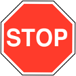 | 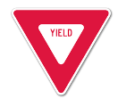 | 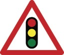 |  |
| Class 0 | Class 3 | Class 2 | Class 1 |

---

## Quick Start and Installation

### 1. Setup Environment
Clone the repository and install required dependencies:
```bash
git clone https://github.com/<your-username>/TrafficSignDetection.git
cd TrafficSignDetection
pip install -r requirements.txt
```

### 2. Run Detection
The interactive CLI processes images sequentially with keyboard navigation:
```bash
# Run default batch evaluation over test dataset
python3 detect.py

# Run on a specific image
python3 detect.py --image images/stopsignFull.jpg

# Run batch evaluation headlessly and save annotated outputs
python3 detect.py --folder images --save --no-display
```

**Interactive Window Controls:**
* **`[SPACE]`** or **`[ENTER]`**: Advance to next image
* **`[Q]`** or **`[ESC]`**: Exit viewer immediately

---

## Pipeline Architecture and Methodology

The system breaks traffic sign recognition into five deterministic stages:

```
Input Image (500x400)
       │
       ▼
1. Illumination & Contrast Enhancement (CLAHE + Gamma + Saturation)
       │
       ▼
2. Spatial Noise Filtering (Median Blur)
       │
       ▼
3. Dual-Band HSV Color Segmentation (Red Hue Masking)
       │
       ▼
4. Morphological Reconstruction & Contour Localization (Closing + Bounding Box)
       │
       ▼
5. CNN Classification & Confidence Gating (Softmax >= 0.85 Threshold)
```

---

### Step 1: Contrast and Illumination Enhancement

To overcome severe shadows and low contrast, the image is converted to the **YUV color space**, where Contrast Limited Adaptive Histogram Equalization (**CLAHE**) is applied strictly to the luminance ($Y$) channel. The result is blended back with the original frame, followed by non-linear gamma lookup table (LUT) transformation and HSV saturation scaling:

```python
# CLAHE on Y luminance channel
img_yuv = cv2.cvtColor(img, cv2.COLOR_BGR2YUV)
clahe = cv2.createCLAHE(clipLimit=2.0, tileGridSize=(8, 8))
img_yuv[:, :, 0] = clahe.apply(img_yuv[:, :, 0])
enhanced = cv2.cvtColor(img_yuv, cv2.COLOR_YUV2BGR)
img = cv2.addWeighted(img, 0.5, enhanced, 0.5, 0)

# Non-linear Gamma shadow brightening (gamma=1.3)
invGamma = 1.0 / 1.3
table = np.array([((i / 255.0) ** invGamma) * 255 for i in range(256)]).astype("uint8")
img = cv2.LUT(img, table)
```

| Original Image (Low Contrast / Shadows) | Enhanced Image (CLAHE + Gamma) |
| :---: | :---: |
| 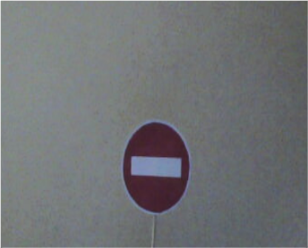 | 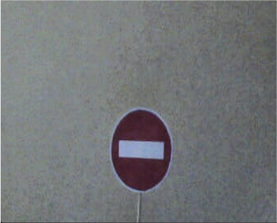 |

| Pre-Saturation / Gamma Boost | Final Illumination Balanced Frame |
| :---: | :---: |
| 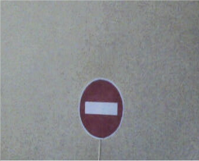 | 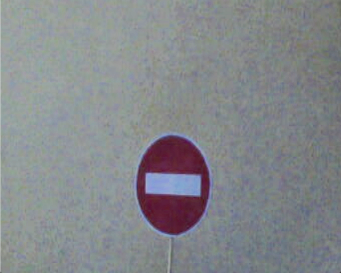 |

---

### Step 2: Denoising and Spatial Filtering

High-frequency sensor noise and weather artifacts (e.g. rain speckles) are suppressed using **Median Blur Filtering** ($k=5$), which preserves structural sign edges while eliminating salt-and-pepper noise:

```python
filtered = cv2.medianBlur(img, 5)
```

| Unfiltered Frame | Filtered Frame (Median Blur) |
| :---: | :---: |
| 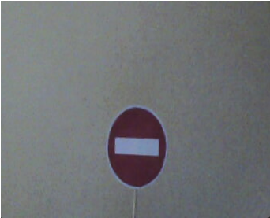 | 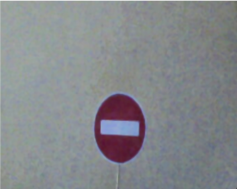 |

---

### Step 3: Dual-Band HSV Color Segmentation

Because red wraps around the 0°/180° boundary in OpenCV's HSV representation, dual color thresholds are extracted and merged with a bitwise-OR operation:

```python
hsv = cv2.cvtColor(img, cv2.COLOR_BGR2HSV)
lower_red1, upper_red1 = np.array([0, 120, 70]), np.array([4, 255, 255])
lower_red2, upper_red2 = np.array([167, 120, 70]), np.array([179, 255, 255])

mask = cv2.bitwise_or(
    cv2.inRange(hsv, lower_red1, upper_red1),
    cv2.inRange(hsv, lower_red2, upper_red2)
)
```

| Raw Binary Red Isolation | Cleaned Feature Mask |
| :---: | :---: |
| 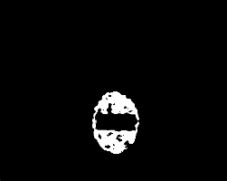 | 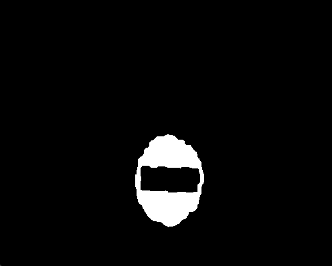 |

---

### Step 4: Binary Object Detection and Morphology

Morphological closing (`MORPH_CLOSE`) using an $11 \times 11$ rectangular kernel bridges internal gaps, fills interior holes caused by lettering/symbols, and solidifies outer sign geometry. Contours are then extracted to generate region-of-interest (ROI) candidate proposals:

```python
_, binary = cv2.threshold(mask, 155, 255, cv2.THRESH_BINARY)
kernel = np.ones((11, 11), np.uint8)
closed = cv2.morphologyEx(binary, cv2.MORPH_CLOSE, kernel)

contours, _ = cv2.findContours(closed, cv2.RETR_TREE, cv2.CHAIN_APPROX_SIMPLE)
```

| Raw Contour Outlines | Extracted Bounding Box Proposal |
| :---: | :---: |
| 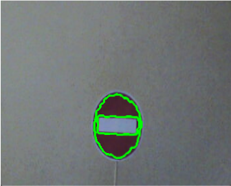 | 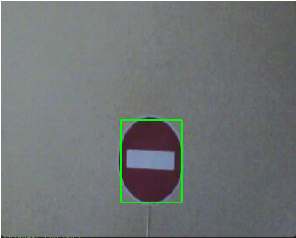 |

---

### Step 5: CNN Classification with Confidence Gating

Candidate bounding box crops are normalized to $28 \times 28$ grayscale and passed through a sequential Convolutional Neural Network. To prevent false positives on arbitrary red objects (such as apples, red cars, or brick walls), predictions below an $85\%$ Softmax confidence threshold are rejected:

```python
crop_gray = cv2.cvtColor(crop, cv2.COLOR_BGR2GRAY)
crop_norm = (cv2.resize(crop_gray, (28, 28)) - 89.774) / 70.852
probs = model.predict(crop_norm.reshape(1, 28, 28, 1), verbose=0)[0]

confidence = np.max(probs)
if confidence >= 0.85:
    label = LABELS[np.argmax(probs)]
else:
    label = "Unknown / Rejected"
```

---

## Pipeline Transformation Step-by-Step

Sequential progression of a single test case from raw input to final annotated output:

| Step 1: Input Image | Step 2: CLAHE & Saturation | Step 3: Median Blur | Step 4: Red Color Mask |
| :---: | :---: | :---: | :---: |
| 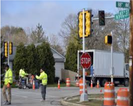 | 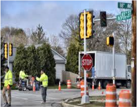 | 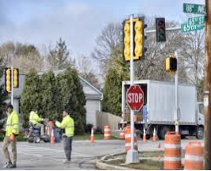 | 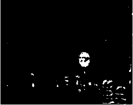 |

| Step 5: Morphological Close | Step 6: Contour Extraction | Step 7: Bounding Box Proposal | Step 8: Final Classified Output |
| :---: | :---: | :---: | :---: |
| 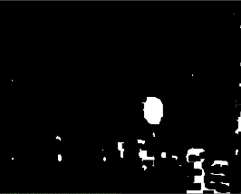 |  |  | 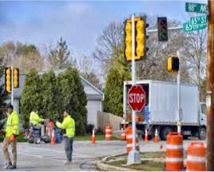 |

---

## Experimental Benchmark Results

Three distinct filtering and contrast enhancement configurations were evaluated on a benchmark set of 55 challenging test images:

| Experiment Configuration | Contrast Method | Spatial Filter | HSV Red Bounds | Contour Accuracy | Classification Accuracy |
| :--- | :--- | :--- | :--- | :---: | :---: |
| **Experiment 1 (Baseline)** | YUV CLAHE | Median Blur ($5\times 5$) | Lower: [0, 4], Upper: [167, 179] | **98.1%** (52/54) | **92.7%** (51/55) |
| **Experiment 2** | Linear Scaling ($\alpha=1.2$) | Gaussian Blur ($5\times 5$) | Lower: [0, 5], Upper: [170, 179] | **98.2%** (53/54) | **92.7%** (51/55) |
| **Experiment 3** | YUV CLAHE | Bilateral ($d=9, \sigma=75$) | Lower: [0, 3], Upper: [173, 179] | **92.6%** (48/54) | **87.2%** (48/55) |

* **Experiment 1** demonstrated the highest noise tolerance and robust edge retention in extreme shadows and rainy environments.
* **Experiment 2** yielded marginally faster execution and slightly higher contour recall through relaxed red color tolerances.
* **Experiment 3** revealed that aggressive bilateral smoothing over-suppressed small signs at long distances.

---

## Project Structure

```
TrafficSignDetection/
├── detect.py                    # Unified CLI detection and inference tool
├── requirements.txt             # Project dependencies
├── .gitignore                   # Git exclusion rules
├── DetectionModel.h5            # Pre-trained CNN model weights
├── EE726_MachineLearning.ipynb  # Dataset preprocessing and CNN training notebook
├── EE726_Project_e1.py          # Experiment 1 implementation (Baseline)
├── EE726_Project_e2.py          # Experiment 2 implementation
├── EE726_Project_e3.py          # Experiment 3 implementation
├── images/                      # Benchmark test images
└── docs_assets/                 # Documentation visual assets
```
