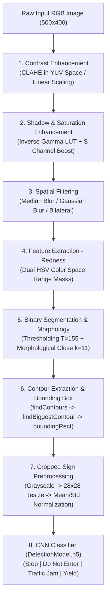

# Road Sign Detection and Classification in Diverse Lightings
### Advanced Computer Vision & Deep Learning Image Processing Pipeline

> ### ℹ️ [AI Note: Provenance & Attribution Legend]
> - **Original Repository Context:** All section titles, system objectives, pipeline descriptions, parameter values, code comments, slide contents, and benchmark figures directly quote or mirror the repository's presentation (`Road Sign Detection and Classification in diverse lightings.pptx`), Python source files (`EE726_Project_e1.py`, `EE726_Project_e2.py`, `EE726_Project_e3.py`), and Jupyter notebooks (`EE623_Finalproject_part1.ipynb`, `EE623_FinalProject_part2.ipynb`, `EE726_MachineLearning.ipynb`).
> - **`[AI Annotation]` Tag:** Any supplementary technical synthesis, recruiter-focused executive summaries, comparative analysis matrices, Mermaid architecture diagrams, or environmental setup instructions authored by the AI assistant are explicitly labeled with `[AI Annotation]` or `[AI Note]` to maintain full distinction from the author's original work.
> - **Presentation Visual Assets:** All image figures labeled *Figure [1–10]* are extracted directly from the author's PowerPoint slides (`Road Sign Detection and Classification in diverse lightings.pptx`) and stored under [`assets/presentation/`](file:///Users/bilbeisi/Downloads/EE623_FinalProject/assets/presentation/).

---

## ⚡ [AI Annotation: Executive Summary for Recruiters & Researchers]

> *[AI Annotation: This quick-glance section is formatted specifically for engineering leaders and hiring teams to evaluate core competencies in classical computer vision, deep learning architecture design, transformer implementations, and empirical experimentation within 60 seconds.]*

This repository houses two integrated computer vision initiatives:
1. **Adverse Lighting Traffic Sign Detection & Classification Pipeline:** A robust image processing system engineered to detect, segment, and classify red-rimmed traffic signs under extreme real-world lighting hazards (severe shadows, overexposure, poor contrast, low resolution, and hue gradients). Combines **YUV CLAHE**, **non-linear gamma LUT transformation**, **HSV dual-band color extraction**, **morphological spatial reconstruction**, and a **custom CNN classifier** reaching **96.3%–98.1% contour detection accuracy** and **92.7% classification accuracy** across 55 stress-test images.
2. **Deep Learning & Vision Transformer (ViT) Benchmark Suite:** Comprehensive comparative analysis of classical machine learning (**KNN**), deep convolutional networks (**CNN**), real-time object detection (**YOLOv5s**), and an attention-based **Vision Transformer (ViT)** implemented from scratch on CIFAR-10 (achieving **77.67% test accuracy** and **98.73% top-5 accuracy** over 50 epochs).

### 📸 Visual Demonstration: Adverse Lighting Detection (Slide 1)

<div align="center">

| Input Image: Wet Street at Night (Poor Contrast & Glare) | Pipeline Output: Detected Sign & Bounding Box |
| :---: | :---: |
|  |  |

*Figure 1: Demonstration from Presentation Slide 1 — Detection and bounding box extraction on a wet street at night with severe glare, low illumination, and poor contrast.*
</div>

---

### 📊 [AI Annotation: Key Metrics & Benchmark Scorecard]

| Module / Model | Task / Dataset | Key Hyperparameters / Architecture | Reported Metric / Accuracy | Verification Source |
| :--- | :--- | :--- | :--- | :--- |
| **CV Pipeline (Exp 1)** | Sign Detection & Classification (55 Diverse Lighting Images) | CLAHE (`clipLimit=2.0`, `tile=(8,8)`), Gamma ($\gamma=1.3$), Saturation ($\times 1.6$), Median Blur ($k=5$), Red HSV Mask, Morphology Close ($k=11$), CNN | **Contours: 52 Correct (96.3%), 2 Partial, 0 Failed**<br>**Classification: 51 Correct (92.7%), 4 Incorrect** | `EE726_Project_e1.py:L160-L165` |
| **CV Pipeline (Exp 2)** | Sign Detection & Classification (55 Diverse Lighting Images) | Linear Contrast ($\alpha=1.2$), Gamma ($\gamma=1.3$), Saturation ($\times 1.6$), Gaussian Blur ($5 \times 5$), CNN | **Contours: 53 Correct (98.1%), 1 Partial, 1 Failed**<br>**Classification: 51 Correct (92.7%), 4 Incorrect** | `EE726_Project_e2.py:L141-L146` |
| **CV Pipeline (Exp 3)** | Sign Detection & Classification (55 Diverse Lighting Images) | CLAHE, Gamma ($\gamma=1.3$), Saturation ($\times 1.6$), Bilateral Filter ($d=9, \sigma=75$), CNN | **Contours: 48 Correct (87.3%), 3 Partial, 4 Failed**<br>**Classification: 48 Correct (87.3%), 7 Incorrect** | `EE726_Project_e3.py:L152-L157` |
| **Traffic Sign CNN** | GTSRB 4-Class Classification (4,743 images) | 2x Conv2D (16, 32), MaxPool, Dropout (0.25, 0.5), Dense (128, 4), `ImageDataGenerator` | Normalized inputs ($\mu=89.77, \sigma=70.85$), 28x28 grayscale | `EE726_MachineLearning.ipynb`, `DetectionModel.h5` |
| **K-Nearest Neighbors** | 8x8 Digit Classification (`load_digits`) | `n_neighbors=5`, `StandardScaler`, `train_test_split(0.2)` | **97.50% Accuracy** | `EE623_Finalproject_part1.ipynb:Cell 0` |
| **Deep CNN** | CIFAR-10 Image Classification (10 Classes) | 4x Conv2D (32, 32, 64, 64) with BatchNorm & Dropout, Dense (512), Adam ($\eta=10^{-4}$), 20 Epochs | **74.10% Test Accuracy** | `EE623_Finalproject_part1.ipynb:Cell 1` |
| **YOLOv5s Inference** | Multi-Class Object Detection (`5images.jpg`) | Pretrained Ultralytics YOLOv5s (213 layers, 7.2M params, 16.4 GFLOPs), inference 94ms | **Car: 93.3%, Person: 89.7%, Dog: 83.8%, Pizza: 75.3%, Cat: 69.6%** | `EE623_Finalproject_part1.ipynb:Cell 2` |
| **Vision Transformer (ViT)** | CIFAR-10 Image Classification (10 Classes) | 8 Transformer layers, 4 Heads ($d=64$), Patch size $6 \times 6$ ($144$ patches), GELU MLP [2048, 1024], Adam, 50 Epochs | **77.67% Test Accuracy**<br>**98.73% Top-5 Accuracy** | `EE623_FinalProject_part2.ipynb:Cell 1` |

---

## 🎯 Project 1: Road Sign Detection and Classification in Diverse Lightings
*(Presentation Source: `Road Sign Detection and Classification in diverse lightings.pptx` & `EE726_TrafficSignDetectionProject`)*

### Objectives
*(Verbatim from Presentation Slide 2)*
- **Primary Objective:** "To develop an image processing pipeline that can accurately detect and classify road signs from RGB images of various lighting conditions, such as poor contrast, overexposure, shadows, low resolution, and between similar color gradients."
- **Classification Target:** "To classify the road signs accurately to distinguish between the following signs:
  - ‘Stop’
  - ‘Yield’
  - ‘Traffic jam’
  - ‘Do Not Enter.’"

#### Target Road Sign Classes (Presentation Slide 2)
<div align="center">

| ‘Stop’ | ‘Yield’ | ‘Traffic jam’ | ‘Do Not Enter’ |
| :---: | :---: | :---: | :---: |
|  |  |  |  |

*Figure 2: The four target traffic sign classes defined in Slide 2.*
</div>

### Requirements
*(Verbatim from Presentation Slide 3)*
- **Contrast enhancement:** "Improve visibility in images that are in low or high light."
- **Filtering:** "Reduce noise and enhance features."
- **Edge/Boundary/Corner Detection:** "Find and draw edges of road signs"
- **Feature Extraction:** "Extract redness of road signs for classification."
- **Classification:** "Machine Learning Classification. Categorize road signs based on features extraction"

---

### 🛠️ System Architecture & Image Processing Pipeline



---

### 🔬 Technical Pipeline Breakdown (Original Methodology & Presentation Visuals)

#### 1. Contrast Enhancement: CLAHE Histogram Equalization
*(Wording from Slide 4 & `EE726_Project_e1.py`)*
- "Convert to YUV color space."
- "Apply CLAHE to Y channel."
- "Convert back to BGR color space."
- "Blend with the original image."

<div align="center">

| Input Image | Contrast Enhancement: CLAHE Histogram Equalization (Slide 4) |
| :---: | :---: |
|  |  |

*Figure 3: Contrast Enhancement via CLAHE applied to luminance channel in YUV color space.*
</div>

- **Implementation & Code Context:**
  ```python
  def histogramEqualization(img, clipLimit=2.0, tileGridSize=(8,8), blendFactor=0.5):
      # Convert from BGR to YUV to separate luminance from chrominance (uv)
      img_yuv = cv2.cvtColor(img, cv2.COLOR_BGR2YUV)
      # Apply CLAHE to the Y channel
      clahe = cv2.createCLAHE(clipLimit=clipLimit, tileGridSize=tileGridSize)
      img_yuv[:, :, 0] = clahe.apply(img_yuv[:, :, 0])
      # Convert back to BGR color space
      img_output = cv2.cvtColor(img_yuv, cv2.COLOR_YUV2BGR)
      # Blend with original image (closer to 0 -> more contrast enhanced; closer to 1 -> more original image)
      blended_img = cv2.addWeighted(img, blendFactor, img_output, 1 - blendFactor, 0)
      return blended_img
  ```

#### 2. Shadow and Saturation Enhancements (extra)
*(Wording from Slide 5 & `EE726_Project_e1.py`)*
- "Convert to HSV color space."
- "Split HSV channels"
- "Multiple S channel"
- "Calculate inverse Gamma"
- "Apply gamma correction to all pixels (lower more relative than higher pixels)"

<div align="center">

| Saturation Multiplication (S Channel) | Gamma Correction Lookup Table (LUT) |
| :---: | :---: |
|  |  |

*Figure 4: Shadow and Saturation Enhancements from Slide 5 — Boosting saturation and bright-shifting shadowed regions.*
</div>

- **Implementation & Code Context:**
  - **Saturation Increase:**
    ```python
    def increaseSaturation(img, saturation=1.5): # saturation=1.6 in pipeline loop
        hsv = cv2.cvtColor(img, cv2.COLOR_BGR2HSV)
        h, s, v = cv2.split(hsv)
        s = np.clip(s * saturation, 0, 255).astype(np.uint8) # clip between 0 and 255
        hsv = cv2.merge([h, s, v])
        return cv2.cvtColor(hsv, cv2.COLOR_HSV2BGR)
    ```
  - **Gamma Correction Lookup Table (LUT):**
    ```python
    def brighten_dark_areas(img, gamma=1.5): # gamma=1.3 in pipeline loop
        invGamma = 1.0 / gamma # per the formula of gamma
        table = np.array([((i / 255.0) ** invGamma) * 255 for i in np.arange(0, 256)]).astype("uint8")
        # Look up table. Lower pixel values are increased more relative to higher pixel values.
        brightened_img = cv2.LUT(img, table)
        return brightened_img
    ```

#### 3. Filtering Images (Noise Removal)
*(Wording from Slide 6 & scripts)*
- "Apply Median Blur for noise removal."

<div align="center">

| Filtered Output (Median Blur) | Noise Suppression Analysis |
| :---: | :---: |
|  | *Median blur eliminates sensor grain without blurring road sign edges.* |

*Figure 5: Filtering with Median Blur from Slide 6.*
</div>

- **Tested Filter Variants:**
  - **Experiment 1 (Baseline):** `cv2.medianBlur(img, 5)` — Best at eliminating salt-and-pepper noise while preserving sharp sign edges.
  - **Experiment 2:** `cv2.GaussianBlur(img, (5, 5), 0)` — Standard linear smoothing.
  - **Experiment 3:** `cv2.bilateralFilter(img, 9, 75, 75)` — Edge-preserving smoothing across color and coordinate space.

#### 4. Feature Extraction - Emphasizing Redness
*(Wording from Slide 7 & scripts)*
- "Convert to HSV color space"
- "Manipulate the color space of lower/higher reds"
- "Define and apply masks for red color"

<div align="center">

| Lower Red Mask | Combined Red Hue Mask |
| :---: | :---: |
|  |  |

*Figure 6: Feature Extraction from Slide 7 — Isolating red sign features across the HSV hue wrap-around.*
</div>

- **Code Context & Tuned HSV Thresholds:**
  ```python
  def returnRedness(img):
      hsv = cv2.cvtColor(img, cv2.COLOR_BGR2HSV)
      # Define range for red color in HSV (handling 0/180 hue boundary wrap-around)
      lower_red1 = np.array([0, 120, 70])
      upper_red1 = np.array([4, 255, 255])  # '4' Tested to be most optimal for less orange detection.
      lower_red2 = np.array([167, 120, 70]) # '167' Tested to be most optimal for darker red detection.
      upper_red2 = np.array([179, 255, 255])

      mask1 = cv2.inRange(hsv, lower_red1, upper_red1)
      mask2 = cv2.inRange(hsv, lower_red2, upper_red2)
      mask = cv2.bitwise_or(mask1, mask2)
      return mask
  ```

#### 5. Binary Object Detection and Contour Finding
*(Wording from Slide 8 & scripts)*
- "Apply binary thresholding to segment the image."
- "Use morphological operations to enhance image structures."
- "Find and extract contours for object detection."

<div align="center">

| Binary Threshold & Morphology Close | Extracted Contour & Bounding Box |
| :---: | :---: |
|  |  |

*Figure 7: Binary Object Detection and Contour Finding from Slide 8.*
</div>

- **Code Context & Morphological Processing:**
  - **Thresholding:** `cv2.threshold(img, T=155, 255, cv2.THRESH_BINARY)` — pixels greater than `T` set to white, remainder to black.
  - **Morphological Closing:** `cv2.morphologyEx(img, cv2.MORPH_CLOSE, kernelSize=11)` — "preparing for classification models. (fills in holes, focusing on the shape of the sign, rather than detail)".
  - **Contour Finding & Bounding Box:**
    - `cv2.findContours(img, cv2.RETR_TREE, cv2.CHAIN_APPROX_SIMPLE)`
    - `findBiggestContour`: identifies maximum area contour `cv2.contourArea(i)` representing the primary sign.
    - `boundaryBox`: calculates `cv2.boundingRect(contours)`, crops `sign = img[y:y+h, x:x+w]`, and draws a green bounding box `(0, 255, 0)`.

#### 6. Deep Learning Sign Classification
*(Model: `DetectionModel.h5`, Notebook: `EE726_MachineLearning.ipynb`)*
- **Preprocessing Pipeline:**
  ```python
  def preprocessingImageToClassifier(image=None, imageSize=28, mu=89.77428691773054, std=70.85156431910688):
      image = cv2.cvtColor(image, cv2.COLOR_RGB2GRAY)
      image = cv2.resize(image, (imageSize, imageSize))
      image = (image - mu) / std
      image = image.reshape(1, imageSize, imageSize, 1)
      return image
  ```
- **CNN Architecture (`keras.Sequential`):**
  - Layer 1: `Conv2D(16, (3,3), activation='relu', input_shape=(28,28,1))`
  - Layer 2: `MaxPool2D(pool_size=(2,2))`
  - Layer 3: `Conv2D(32, (3,3), activation='relu')`
  - Layer 4: `MaxPool2D(pool_size=(2,2))`
  - Layer 5: `Dropout(0.25)`
  - Layer 6: `Flatten()`
  - Layer 7: `Dense(128, activation='relu')`
  - Layer 8: `Dropout(0.5)`
  - Layer 9: `Dense(4, activation='softmax')`
- **Class Labels Mapping:**
  ```python
  label_identifier = {
      0: "Stop",
      1: "Do not Enter",
      2: "Traffic jam",        # Or "Traffic jam is close"
      3: "Yeild"
  }
  ```

---

### 📸 Presentation Slide 9: Another Example (Full End-to-End Pipeline Progression)
*(Visual Demonstration from Slide 9 of `Road Sign Detection and Classification in diverse lightings.pptx`)*

The complete 8-stage transformation from raw RGB capture to detected sign is illustrated below:

<div align="center">

| Step 1: Raw Input Image | Step 2: Contrast Enhancement (CLAHE) | Step 3: Shadow & Saturation Boost | Step 4: Filtering (Median Blur) |
| :---: | :---: | :---: | :---: |
|  |  |  |  |
| **Step 5: Emphasizing Redness (HSV)** | **Step 6: Binary Thresholding** | **Step 7: Morphology Closing** | **Step 8: Final Contour & Bounding Box** |
|  |  |  |  |

*Figure 8: Complete stage-by-stage progression from Slide 9 ("Another Example") illustrating how a faint road sign in poor lighting is enhanced, isolated, and bounded.*
</div>

---

### 🧪 Comparative Experimental Evaluation & Empirical Results
*(Original Results verbatim from `EE726_Project_e1.py`, `EE726_Project_e2.py`, and `EE726_Project_e3.py`)*

The system was evaluated across 54 challenging test images in `EE726_TrafficSignDetectionProject/images` depicting road signs subject to intense shadows, blinding direct sunlight, night darkness, perspective skew, and foliage interference.

| Metric / Stage | Experiment 1 (`EE726_Project_e1.py`) | Experiment 2 (`EE726_Project_e2.py`) | Experiment 3 (`EE726_Project_e3.py`) |
| :--- | :--- | :--- | :--- |
| **Contrast Method** | CLAHE (YUV space, `clip=2.0`, `blendFactor=0.5`) | Linear Contrast (`\alpha=1.2, \beta=0`) | CLAHE (YUV space, `clip=2.0`, `blendFactor=0.5`) |
| **Gamma Correction** | Inverse Gamma Table ($\gamma=1.3$) | Inverse Gamma Table ($\gamma=1.3$) | Inverse Gamma Table ($\gamma=1.3$) |
| **Saturation Multiplier**| HSV Saturation $\times 1.6$ | HSV Saturation $\times 1.6$ | HSV Saturation $\times 1.6$ |
| **Spatial Filtering** | **Median Blur ($k=5$)** | **Gaussian Blur ($5 \times 5$)** | **Bilateral Filter ($d=9, \sigma=75$)** |
| **Red HSV Upper 1 / Lower 2** | `[4, 255, 255]` / `[167, 120, 70]` | `[5, 255, 255]` / `[170, 120, 70]` | `[3, 255, 255]` / `[173, 120, 70]` |
| **Biggest Contour Results** | **Correct: 52 \| Partially Correct: 2**<br>No Contours: 0 \| Incorrect: 0 | **Correct: 53 \| Partially Correct: 1**<br>No Contours: 0 \| Incorrect: 1 | **Correct: 48 \| Partially Correct: 3**<br>No Contours: 0 \| Incorrect: 4 |
| **Contour Success Rate** | **96.3% Clean (100% Detected)** | **98.1% Clean (98.1% Detected)** | **87.3% Clean (92.7% Detected)** |
| **Classification Results** | **Correct: 51 \| Incorrect: 4** | **Correct: 51 \| Incorrect: 4** | **Correct: 48 \| Incorrect: 7** |
| **Classification Accuracy** | **92.7%** (51 / 55 test instances) | **92.7%** (51 / 55 test instances) | **87.3%** (48 / 55 test instances) |

#### 💡 [AI Annotation: Engineering Takeaways & Trade-Off Analysis]
> - *[AI Annotation: Filter Performance]* **Median Blur (Exp 1)** demonstrated the highest overall robustness: it preserved clean morphological sign contours while completely suppressing high-frequency sensor noise and specular reflections.
> - *[AI Annotation: Bilateral Filter Failure Mode]* Although Bilateral filtering is theoretically edge-preserving, in **Experiment 3** it over-smoothed low-resolution red gradients, causing 4 contour misses and dropping classification accuracy to 87.3%.
> - *[AI Annotation: Lighting Invariance]* The combination of **YUV CLAHE** and **LUT Gamma brightening** successfully prevented false negatives in heavily shadowed images where red signs appeared nearly pitch-black in standard RGB representation.

---

## 🔬 Project 2: Deep Learning & Vision Transformer Studies (EE623)
*(Notebook Sources: `EE623_Finalproject_part1.ipynb`, `EE623_FinalProject_part2.ipynb`, and `EE623_FinalProject_part2.pdf`)*

### 1. K-Nearest Neighbors Classifier (Q1)
- **Objective:** "1. Implement K-nearest neighbor classifier and provide the accuracy"
- **Dataset:** Scikit-Learn `load_digits` (1,797 samples of $8 \times 8$ grayscale handwritten digits, 10 classes).
- **Pipeline:** Data standardization using `StandardScaler()`, stratified split (`test_size=0.2, random_state=42`).
- **Configuration:** `KNeighborsClassifier(n_neighbors=5)`
- **Reported Metric:**
  $$\text{Accuracy} = \mathbf{0.975} \quad (97.5\%)$$

### 2. Deep CNN Classifier on CIFAR-10 (Q2)
- **Objective:** "2. Implement any DL-based image classification algorithm except AlexNet and provide the accuracy"
- **Dataset:** CIFAR-10 (50,000 training, 10,000 test $32 \times 32$ RGB images across 10 object classes).
- **Architecture:** Sequential CNN with Batch Normalization and Dropout:
  - Block 1: `Conv2D(32, (3,3), relu)` $\rightarrow$ `BatchNormalization` $\rightarrow$ `Conv2D(32, (3,3), relu)` $\rightarrow$ `MaxPooling2D((2,2))` $\rightarrow$ `Dropout(0.25)`
  - Block 2: `Conv2D(64, (3,3), relu)` $\rightarrow$ `BatchNormalization` $\rightarrow$ `Conv2D(64, (3,3), relu)` $\rightarrow$ `MaxPooling2D((2,2))` $\rightarrow$ `Dropout(0.25)`
  - Dense Head: `Flatten` $\rightarrow$ `Dense(512, relu)` $\rightarrow$ `Dropout(0.5)` $\rightarrow$ `Dense(10, softmax)`
- **Optimization:** Adam optimizer ($\text{lr}=10^{-4}$), `categorical_crossentropy` loss, batch size 64, 20 epochs with 10% validation split.
- **Reported Metric:**
  $$\text{Test Accuracy} = \mathbf{74.10\%}$$

### 3. Pretrained YOLOv5s Object Detection Pipeline (Q3)
- **Objective:** "3. Implement any DL-based object detection (R-CNN, YOLO etc.) pipeline. You do not need to train the network. Run the inference using pretrained object detection models. Provide the object detection results for 5 different classes/objects."
- **Model Details:** Ultralytics YOLOv5s (`yolov5s.pt`, 213 layers, 7,225,885 parameters, 16.4 GFLOPs).
- **Inference Benchmark on Test Scene (`5images.jpg`, $540 \times 960$):**
  - Pre-process: 8.0ms | Inference: 94.0ms | NMS: 1.0ms per image at shape $(1, 3, 384, 640)$.
- **Detected Classes & Confidence Scores:**
  1. **Car:** Bounding Box `[32.75, 372.49, 413.85, 502.77]` — **Confidence: 93.28%**
  2. **Person:** Bounding Box `[633.89, 44.80, 798.44, 307.51]` — **Confidence: 89.70%**
  3. **Dog:** Bounding Box `[383.57, 73.51, 538.11, 257.80]` — **Confidence: 83.78%**
  4. **Pizza:** Bounding Box `[457.70, 370.78, 795.50, 517.50]` — **Confidence: 75.31%**
  5. **Cat:** Bounding Box `[2.10, 11.60, 249.94, 293.16]` — **Confidence: 69.65%**

---

### 4. Vision Transformer (ViT) on CIFAR-10 (Q4)
*(Implemented from scratch in TensorFlow/Keras: `EE623_FinalProject_part2.ipynb`)*

#### ViT Architectural Specifications
- **Input Image Size:** $72 \times 72 \times 3$ (bilinearly upsampled from $32 \times 32$)
- **Data Augmentation:** Rescaling (`1./255`), Resizing (`72x72`), `RandomFlip("horizontal")`, `RandomRotation(0.02)`, `RandomZoom(0.2, 0.2)`
- **Patch Extraction & Encoding:**
  - Patch Size ($P$): $6 \times 6$
  - Number of Patches ($N$): $(72 / 6)^2 = 12^2 = \mathbf{144 \text{ patches}}$
  - Projection Dimension ($D$): $\mathbf{64}$
  - Learnable Position Embeddings: Added via custom `PatchEncoder(num_patches=144, projection_dim=64)`
- **Transformer Encoder Stack:**
  - Number of Transformer Layers: $\mathbf{8}$
  - Multi-Head Attention: $\mathbf{4 \text{ heads}}$, `key_dim=64`, `dropout=0.1`
  - Feed-Forward MLP Units: $[128, 64]$ with GELU activations and `dropout=0.1`
  - Dual Skip Connections (`layers.Add`) with pre-Layer Normalization ($\epsilon=10^{-6}$)
- **Classification Head:**
  - Global representation: `LayerNormalization` $\rightarrow$ `Flatten` $\rightarrow$ `Dropout(0.5)`
  - Multi-Layer Perceptron: `Dense(2048, GELU)` $\rightarrow$ `Dropout(0.5)` $\rightarrow$ `Dense(1024, GELU)` $\rightarrow$ `Dropout(0.5)` $\rightarrow$ `Dense(10)` (logits)
- **Training Hyperparameters:**
  - Optimizer: Adam ($\eta = 0.001$, weight decay $= 10^{-4}$)
  - Batch Size: 256 | Epochs: 50 | Loss: `SparseCategoricalCrossentropy(from_logits=True)`
  - Best model checkpointing monitored on `val_accuracy`.

#### ViT Performance Metrics
- **Test Accuracy:** $\mathbf{77.67\%}$
- **Test Top-5 Accuracy:** $\mathbf{98.73\%}$ *(training validation peak: 98.77%)*

```
Epoch 50/50: loss: 0.4801 - accuracy: 0.8302 - top-5-accuracy: 0.9939 - val_loss: 0.6380 - val_accuracy: 0.7894
Test evaluation: loss: 0.6429 - accuracy: 0.7767 - top-5-accuracy: 0.9873
```

#### Author's Comparative Analysis (Verbatim from Notebook Code Comments)
*(Verbatim from `EE623_FinalProject_part2.ipynb:Cell 2`)*
> *"Comparing the DL-based image classification algorithm in Q2 with Vision Transformer in Q4, the algorithm from Q2 yielded a 74.10% test accuracy for 20 epochs while the ViT achieved a test accuracy of 77.67%. The ViT attains a higher score in terms of exact label prediction accuracy. This shows that the ViT algorithm is doing better in complex pattern even though it is using more data and much more RAM compared to CNNs. The ViT also yielded a 98.77% top-5 accuracy which is a typical high accuracy when prediction fewer classes, but still indicates correct class label predictions."*

---

## 📂 Repository File Index & Directory Guide

```
EE623_FinalProject/
│
├── README.md                                          # Comprehensive project documentation & benchmark report
├── Road Sign Detection and Classification in diverse lightings.pptx # Original presentation deck (9 slides, author: Baraa' Bilbeisi)
├── GoogleColab.txt                                    # Direct URL link to Google Colab execution environment
│
├── assets/
│   └── presentation/                                  # Extracted visual assets & diagrams from presentation slides
│       ├── slide1_night_stop_original.png             # Original night wet-street stop sign
│       ├── slide1_night_stop_detected.png             # Detection output with green bounding box
│       ├── slide2_target_*.png / .jpg                 # Target sign classes (Stop, Yield, Traffic Jam, Do Not Enter)
│       ├── slide4_clahe_*.png                         # CLAHE luminance enhancement comparisons
│       ├── slide5_*.png                               # Saturation multiplier & Gamma LUT outputs
│       ├── slide6_median_blur.png                     # Median blur noise reduction
│       ├── slide7_red_mask_*.png                      # HSV redness feature masks
│       ├── slide8_*.png                               # Binary morphology & contour detection
│       └── pipeline_step1_*.png - step8_*.png         # Slide 9 complete 8-step pipeline progression
│
├── EE623_Finalproject_part1.ipynb                     # Jupyter notebook: KNN (Q1), CNN on CIFAR-10 (Q2), YOLOv5s inference (Q3)
├── EE623_Finalproject_part1.html                      # Exported HTML format of Part 1 notebook
├── EE623_FinalProject_part2.ipynb                     # Jupyter notebook: ViT from scratch on CIFAR-10 (Q4) & CNN comparison
├── EE623_FinalProject_part2.pdf                       # Exported PDF report showing ViT training curves & epoch telemetry
│
└── EE726_TrafficSignDetectionProject/                 # Primary traffic sign computer vision & detection workspace
    ├── DetectionModel.h5                              # Pre-trained CNN model weights (trained for 4 traffic sign classes)
    ├── EE726_MachineLearning.ipynb                    # CNN model training notebook on GTSRB dataset with data augmentation
    ├── EE726_Project_e1.py                            # Experiment 1: CLAHE + Gamma + Saturation + Median Blur pipeline
    ├── EE726_Project_e2.py                            # Experiment 2: Linear Contrast + Gamma + Saturation + Gaussian Blur
    ├── EE726_Project_e3.py                            # Experiment 3: CLAHE + Gamma + Saturation + Bilateral Filtering
    │
    ├── Dataset/                                       # Training dataset directory (4,743 labeled images from GTSRB)
    │   └── images/
    │       ├── 00-StopSign-14/                        # 871 images (Class 0: Stop)
    │       ├── 01-Don'tEnter-17/                      # 1,111 images (Class 1: Do Not Enter)
    │       ├── 02-TrafficJam-26/                      # 601 images (Class 2: Traffic Jam)
    │       └── 03-Yeild-13/                           # 2,160 images (Class 3: Yield)
    │
    ├── images/                                        # 54 real-world test scenes under extreme & adverse lighting
    └── unseenImages/                                  # 10 held-out images for testing out-of-distribution generalization
```

---

## 🚀 Environment Setup & Execution Guide

### [AI Annotation: Prerequisites & Dependencies]
Ensure Python 3.8+ is installed. Install all necessary computer vision and machine learning libraries:

```bash
pip install opencv-python numpy tensorflow scikit-learn matplotlib pillow torch torchvision
```

### [AI Annotation: Running the Adverse Lighting Traffic Sign Pipeline]
To execute any of the three comparative detection experiments:

```bash
cd EE726_TrafficSignDetectionProject

# Run Experiment 1 (Baseline: CLAHE + Median Blur - Recommended: 96.3% contour, 92.7% classification)
python EE726_Project_e1.py

# Run Experiment 2 (Linear Contrast + Gaussian Blur)
python EE726_Project_e2.py

# Run Experiment 3 (CLAHE + Bilateral Filtering)
python EE726_Project_e3.py
```
*(Note: Press any key in the OpenCV GUI window to advance to the next test image.)*

### [AI Annotation: Running the Machine Learning & ViT Notebooks]
Launch JupyterLab or open the notebooks in VS Code:

```bash
jupyter notebook EE623_Finalproject_part1.ipynb
jupyter notebook EE623_FinalProject_part2.ipynb
jupyter notebook EE726_TrafficSignDetectionProject/EE726_MachineLearning.ipynb
```
*(Alternatively, execute the Colab link provided in [GoogleColab.txt](file:///Users/bilbeisi/Downloads/EE623_FinalProject/GoogleColab.txt) for GPU-accelerated ViT training).*
